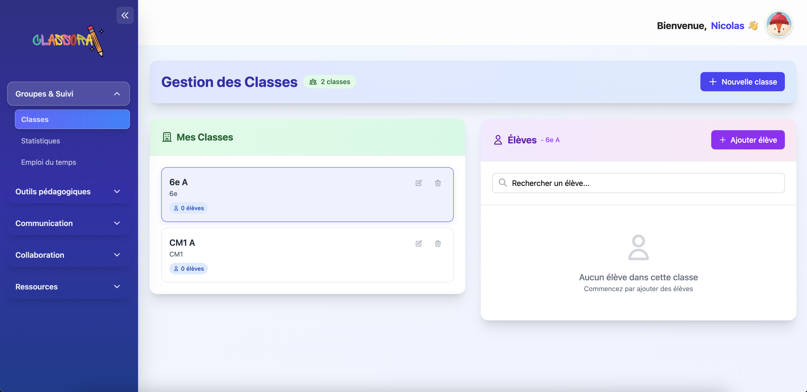

# Classora

  
  
<em>Modern and intuitive Classora interface</em>

An integrated school management platform for teachers, combining lesson planning, educational tracking, administrative task automation, and collaboration between teachers.

## 🚀 Technical Architecture

- **Backend**: Django with Django REST Framework and PostgreSQL
- **Frontend**: Angular 19
- **Authentication**: JWT (JSON Web Tokens)

## 📚 Main Modules

- **Users**: User management, roles, and permissions
- **Calendar**: Planning, scheduling, and synchronization
- **Classroom_diary**: Class diary
- **Courses**: Creation of teaching sequences and resources
- **Students**: Student tracking, groups, and performance
- **Grades**: Assessments, grades, and competencies
- **Communications**: School-parents-teachers messaging
- **Collaboration**: Collaborative work between teachers
- **Marketplace**: Sharing and acquiring educational resources
- **Core**: Cross-functional services, AI, and integrations
- **Billing**: Subscription and payment management
- **Support**: User assistance and FAQ